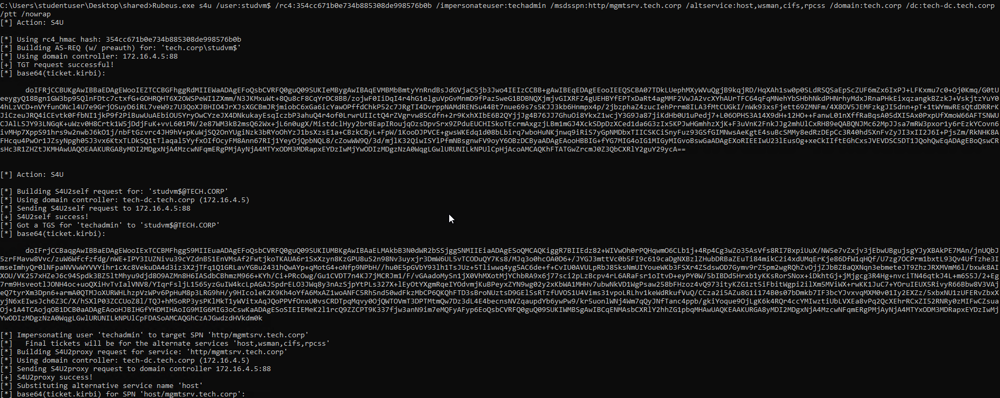
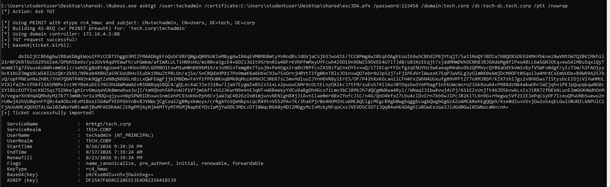

# CRTP Exam Report - Altered Security design, rendered offline

A complete, professional CRTP (Certified Red Team Professional) exam report,
rendered with the official **Altered Security** SysReptor design - but produced
entirely offline with WeasyPrint, so you never have to upload anything to a
SysReptor instance.

You edit one YAML file, run one command, and get a polished, branded PDF.

```
python3 render.py            # -> out/report.html  and  out/report.pdf
```

## What's here

| Path | What it is |
| :--- | :--- |
| `report.yml` | **The only file you edit.** All report content: summary, scope, findings F-1…F-9. |
| `render.py` | The renderer. Reproduces the SysReptor design from `report.yml`. |
| `images/` | All 75 exam screenshots (`img00.png`…`img74.png`), pulled from the Notion page. See `images/README.md` for the finding-by-finding map. |
| `design/styles.css` | The **untouched** Altered Security design export (do not edit). |
| `design/base.css` | Reconstruction of the SysReptor global stylesheet the design imports. |
| `design/renderer.css` | Small, documented deviations from the export (finding numbering, evidence sizing). |
| `design/assets/` | Cover photo, logo and methodology diagram from the design. |
| `out/report.pdf` | The rendered deliverable. |
| `requirements.txt` | Python dependencies. |

## Setup

```bash
pip install -r requirements.txt
python3 render.py
```

WeasyPrint is the same rendering engine SysReptor uses, so the output matches
the design as intended.

## Editing the report

Open `report.yml`. Every field marked `(markdown)` accepts markdown - tables,
**bold**, `inline code`, fenced ```code blocks```, and images.

**Add a screenshot** as a captioned figure (it auto-numbers and appears in the
List of Figures):

```markdown

```

**Make an image larger** (for full-width terminal captures) by adding
`{.evidence}`:

```markdown
{.evidence}
```

**Add a finding**: copy one `- title: …` block under `findings:` and fill in the
fields (`title`, `hostname`, `fqdn`, `ip_address`, `os_details`, `description`,
`compromission_steps`, `recommendation`, `references`).

Preview quickly without rendering the PDF each time:

```bash
python3 render.py --html-only && open out/report.html
```

## The attack chain (F-1 → F-9)

Assumed breach as `tech\studentuser` on **STUDVM**, ending in full compromise of
the `finance.corp` forest across the trust:

1. **F-1** Cleartext credentials in the `maintenance` file share → `studentadmin`
2. **F-2** Local admin + LSASS dump → `STUDVM$`
3. **F-3** Domain recon (adPEAS, BloodHound) - trust, delegation, AD CS, LAPS gaps
4. **F-4** Resource-Based Constrained Delegation → impersonate DA on MGMTSRV → `techservice`
5. **F-5** ACL abuse - AddSelf to `Management`, Force-Change-Password `puretech`
6. **F-6** Lateral movement to TECHSRV30 → SAM secrets (`securetech`)
7. **F-7** LSA secrets → `causer` (SNMPTRAP), `ADMINSRV86$`
8. **F-8** AD CS **ESC3** enrollment-agent abuse → Domain Admin (`techadmin`)
9. **F-9** Trust-key forgery → cross-forest to `finance.corp` → final flag

## Note on secrets

The hashes, passwords and the final flag in this report are the real values
captured in the isolated CRTP exam lab, included as proof of compromise per exam
convention. The one value not captured in the screenshots - the `finadmin.pfx`
export password in F-9 - is left as `<pfx-password>`; set it to the password you
chose during the `openssl` export.
